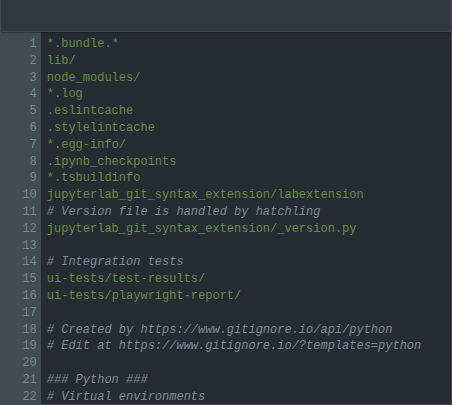

# jupyterlab_git_syntax_extension

[](https://github.com/stellarshenson/jupyterlab_git_syntax_extension/actions/workflows/build.yml)
[](https://www.npmjs.com/package/jupyterlab_git_syntax_extension)
[](https://pypi.org/project/jupyterlab-git-syntax-extension/)
[](https://pepy.tech/project/jupyterlab-git-syntax-extension)
[](https://jupyterlab.readthedocs.io/en/stable/)
[](https://kolomolo.com)
[](https://www.paypal.com/donate/?hosted_button_id=B4KPBJDLLXTSA)

> [!TIP]
> This extension is part of the [stellars_jupyterlab_extensions](https://github.com/stellarshenson/stellars_jupyterlab_extensions) metapackage. Install all Stellars extensions at once: `pip install stellars_jupyterlab_extensions`

Syntax highlighting for git configuration files in JupyterLab. Open `.gitignore`, `.gitmodules`, `.gitattributes`, `.gitconfig` and other git files with proper syntax colouring instead of plain text.



## Features

- **Gitignore highlighting** - comments, negation patterns (`!`), glob wildcards (`*`, `**`, `?`), character classes (`[...]`), path separators
- **Gitconfig / Gitmodules highlighting** - INI-style section headers (`[remote "origin"]`), key-value pairs, booleans (`true`/`false`/`yes`/`no`/`on`/`off`), numbers with size suffixes, comments (`#`, `;`), continuation lines
- **Gitattributes highlighting** - file patterns, macro definitions (`[attr]`), set/unset/unspecify attributes, attribute values
- **Automatic file detection** - files matched by name (`.gitignore`, `.gitconfig`, `.gitmodules`, `.gitattributes`) and extension
- **Icon-safe** - registers only language support, does not override file type icons set by other extensions (e.g. [jupyterlab_vscode_icons_extension](https://github.com/stellarshenson/jupyterlab_vscode_icons_extension))

## Supported Files

| Language       | Files                                 | MIME Type              |
| -------------- | ------------------------------------- | ---------------------- |
| Gitignore      | `.gitignore`                          | `text/x-gitignore`     |
| Git Config     | `.gitconfig`, `.gitmodules`, `config` | `text/x-gitconfig`     |
| Git Attributes | `.gitattributes`                      | `text/x-gitattributes` |

## Requirements

- JupyterLab >= 4.0.0

## Install

```bash
pip install jupyterlab_git_syntax_extension
```

## Uninstall

```bash
pip uninstall jupyterlab_git_syntax_extension
```
